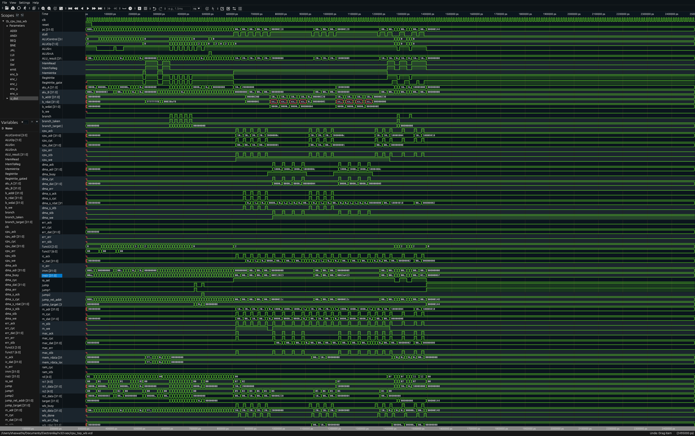

# RV32I SoC

A single-cycle RISC-V RV32I CPU implemented in Verilog. The processor executes one instruction per clock cycle with a classic five-stage datapath — **Fetch → Decode → Execute → Memory → Writeback** — wired combinationally in a single cycle. The design is fully simulatable with [Icarus Verilog](https://steveicarus.github.io/iverilog/) and includes a self-checking testbench that verifies arithmetic, memory, branch, and jump operations.

## Table of Contents

- [Repository Structure](#repository-structure)
- [CPU Datapath](#cpu-datapath)
- [Supported Instructions](#supported-instructions)
- [Waveform Output](#waveform-output)
- [Setup](#setup)
- [Compile & Run](#compile--run)
- [License](#license)

## Repository Structure

```
rv32i-soc/
├── hardware/
│   ├── src/
│   │   ├── core/
│   │   │   ├── cpu_top.v              # Top-level CPU module
│   │   │   ├── if/                    # Instruction Fetch stage
│   │   │   │   ├── program_counter.v  # PC with branch/jump/stall support
│   │   │   │   ├── inst_mem.v         # Instruction memory (reads program.hex)
│   │   │   │   └── program.hex        # Test program in hex
│   │   │   ├── id/                    # Instruction Decode stage
│   │   │   │   ├── control_unit.v     # Main control decoder
│   │   │   │   ├── immediate_gen.v    # Immediate generator (I/S/B/J-type)
│   │   │   │   ├── branch.v           # Branch target & taken logic
│   │   │   │   └── jump.v             # Jump target & return address logic
│   │   │   ├── ex/                    # Execute stage
│   │   │   │   ├── alu_control.v      # ALU operation decoder & field extractor
│   │   │   │   ├── alu_module.v       # ALU (ADD, SUB)
│   │   │   │   ├── alu_src_mux.v      # MUX: rs2_data vs immediate
│   │   │   │   └── reg_file.v         # 32 × 32-bit register file
│   │   │   └── mem/                   # Memory / Writeback stage
│   │   │       ├── data_memory.v      # Data memory (reads data.hex)
│   │   │       ├── mem_stage.v        # Memory stage wrapper
│   │   │       ├── writeback_mux.v    # MUX: ALU result vs memory data
│   │   │       └── data.hex           # Initial data memory contents
│   │   └── include/                   # Shared headers / defines
│   └── test_bench/
│       ├── tb_cpu_top.v               # Top-level self-checking testbench
│       └── stage/                     # Per-stage unit testbenches
│           ├── if/                    # IF stage testbenches
│           ├── id/                    # ID stage testbenches
│           ├── ex/                    # EX stage testbenches
│           └── mem/                   # MEM stage testbenches
├── build/                             # Simulation outputs (.vcd, executables)
├── documentation/                     # Diagrams, waveforms, docs
└── LICENSE
```

## CPU Datapath

<!-- Add your CPU datapath diagram here -->


## Supported Instructions

The processor currently supports the following subset of the RV32I base integer instruction set:

| Type | Instructions | Opcode | Description |
|------|-------------|--------|-------------|
| **R-type** | `ADD`, `SUB` | `0110011` | Register-register arithmetic |
| **I-type** | `ADDI` | `0010011` | Register-immediate arithmetic |
| **I-type** | `LW` | `0000011` | Load word from data memory |
| **S-type** | `SW` | `0100011` | Store word to data memory |
| **B-type** | `BEQ` | `1100011` | Branch if equal |
| **J-type** | `JAL` | `1101111` | Jump and link |

## Waveform Output

The self-checking testbench [`tb_cpu_top.v`](hardware/test_bench/tb_cpu_top.v) runs a small program that exercises all supported instruction types — including arithmetic, load/store, branching, and jumping — and verifies correct execution at each cycle.

The waveform below shows the simulation output captured from the `.vcd` dump:



## Setup

### Prerequisites

1. **Icarus Verilog** — open-source Verilog simulation and synthesis tool.

   Download and install from the official site: [https://steveicarus.github.io/iverilog/](https://steveicarus.github.io/iverilog/)

   Or install via a package manager:

   ```bash
   # macOS (Homebrew)
   brew install icarus-verilog

   # Ubuntu / Debian
   sudo apt install iverilog

   # Arch Linux
   sudo pacman -S iverilog
   ```

2. **Waveform Viewer** — to inspect `.vcd` signal dumps.

   Install any waveform viewer that supports VCD files. Recommended options:

   - [GTKWave](https://gtkwave.github.io/gtkwave/) — classic, widely-used VCD viewer
   - [Surfer](https://surfer-project.org/) — modern, fast waveform viewer

## Compile & Run

All commands are run from the repository root.

### 1. Compile

```bash
iverilog -o build/sim_cpu_top \
  hardware/test_bench/tb_cpu_top.v \
  hardware/src/core/cpu_top.v \
  hardware/src/core/if/program_counter.v \
  hardware/src/core/if/inst_mem.v \
  hardware/src/core/id/control_unit.v \
  hardware/src/core/id/immediate_gen.v \
  hardware/src/core/id/branch.v \
  hardware/src/core/id/jump.v \
  hardware/src/core/ex/alu_control.v \
  hardware/src/core/ex/alu_module.v \
  hardware/src/core/ex/alu_src_mux.v \
  hardware/src/core/ex/reg_file.v \
  hardware/src/core/mem/data_memory.v \
  hardware/src/core/mem/mem_stage.v \
  hardware/src/core/mem/writeback_mux.v
```

### 2. Execute

```bash
vvp build/sim_cpu_top
```

A successful run prints:

```
PASS: all checks passed
```

This also generates `cpu_top.vcd` in the working directory.

### 3. View Waveform

```bash
# GTKWave
gtkwave cpu_top.vcd

# Surfer
surfer cpu_top.vcd
```

## License

This project is licensed under the [MIT License](LICENSE).
