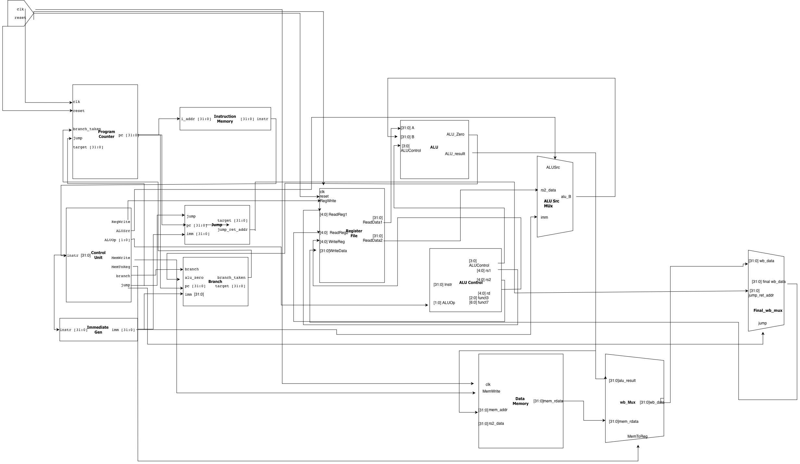

# RV32I SoC

A single-cycle RISC-V RV32I CPU implemented in Verilog. The processor executes one instruction per clock cycle with a classic five-stage datapath — **Fetch → Decode → Execute → Memory → Writeback** — wired combinationally in a single cycle. The design is fully simulatable with [Icarus Verilog](https://steveicarus.github.io/iverilog/) and includes a self-checking testbench that verifies arithmetic, memory, branch, and jump operations.

## Table of Contents

- [Repository Structure](#repository-structure)
- [CPU Datapath](#cpu-datapath)
- [Supported Instructions](#supported-instructions)
- [Waveform Output](#waveform-output)
- [Setup](#setup)
- [Compile & Run](#compile--run)
- [License](#license)

## Repository Structure

```
rv32i-soc/
├── README.md
├── LICENSE
├── build/                             # Generated simulation outputs
├── documentation/
│   ├── RV32I_Processor_Control_Signals.md
│   ├── data_path.png
│   └── waveform.png
├── hardware/
│   ├── src/
│   │   └── core/
│   │       ├── cpu_top.v              # Top-level single-cycle CPU
│   │       ├── if/
│   │       │   ├── inst_mem.v         # Instruction memory, reads program.hex
│   │       │   ├── program_counter.v  # PC update logic with branch/jump support
│   │       │   └── program.hex       # Program image for the CPU testbench
│   │       ├── id/
│   │       │   ├── branch.v           # Branch condition and target generation
│   │       │   ├── control_unit.v     # Opcode decode and control signals
│   │       │   ├── immediate_gen.v    # Sign-/zero-extended immediate generation
│   │       │   └── jump.v             # JAL / JALR target logic
│   │       ├── ex/
│   │       │   ├── alu_control.v      # Decodes ALU op, funct3/funct7 and register fields
│   │       │   ├── alu_module.v       # Arithmetic / logical ALU implementation
│   │       │   ├── alu_src_mux.v      # Selects rs2_data or immediate for ALU input B
│   │       │   └── reg_file.v         # 32 x 32 register file
│   │       ├── mem/
│   │       │   ├── data.hex           # Initial data memory contents
│   │       │   └── data_memory.v      # Memory read/write implementation
│   │       └── wb/
│   │           └── writeback_mux.v    # Selects ALU result, memory data, or return address
│   └── test_bench/
│       ├── tb_cpu_top.v               # Top-level self-checking RTL testbench
│       └── stage/
│           ├── ex/
│           ├── id/
│           ├── if/
│           ├── mem/
│           └── wb/
└──
```

## CPU Datapath

<!-- Add your CPU datapath diagram here -->


## Supported Instructions

The current RTL implements a RV32I-style integer core with the following instruction groups:

| Type | Instructions |
|------|-------------|
| **R-type** | `ADD`, `SUB`, `AND`, `OR`, `XOR`, `SLL`, `SRL`, `SRA`, `SLT`, `SLTU` |
| **I-type ALU** | `ADDI`, `ANDI`, `ORI`, `XORI`, `SLLI`, `SRLI`, `SRAI`, `SLTI`, `SLTIU` |
| **Load** | `LB`, `LH`, `LW`, `LBU`, `LHU` |
| **Store** | `SB`, `SH`, `SW` |
| **Branch** | `BEQ`, `BNE`, `BLT`, `BGE`, `BLTU`, `BGEU` |
| **Jump / link** | `JAL`, `JALR` |
| **U-type** | `LUI`, `AUIPC` |

This matches the control decode and ALU handling implemented in `control_unit.v`, `alu_control.v`, and `jump.v`.

## Waveform Output

The self-checking testbench [`tb_cpu_top.v`](hardware/test_bench/tb_cpu_top.v) runs a small program that exercises all supported instruction types — including arithmetic, load/store, branching, and jumping — and verifies correct execution at each cycle.

The waveform below shows the simulation output captured from the `.vcd` dump:


Refer to [Processor_Control_Signals](documentation/RV32I_Processor_Control_Signals.md) for explanation of what these signals mean.

## Setup

### Prerequisites

1. **Icarus Verilog** — open-source Verilog simulation and synthesis tool.

   Download and install from the official site: [https://steveicarus.github.io/iverilog/](https://steveicarus.github.io/iverilog/)

   Or install via a package manager:

   ```bash
   # macOS (Homebrew)
   brew install icarus-verilog

   # Ubuntu / Debian
   sudo apt install iverilog

   # Arch Linux
   sudo pacman -S iverilog
   ```

2. **Waveform Viewer** — to inspect `.vcd` signal dumps.

   Install any waveform viewer that supports VCD files. Recommended options:

   - [GTKWave](https://gtkwave.github.io/gtkwave/) — classic, widely-used VCD viewer
   - [Surfer](https://surfer-project.org/) — modern, fast waveform viewer

## Compile & Run

All commands are run from the repository root using `make`.

### 1. Compile & Execute

To compile the RTL sources and run the simulation in one step:

```bash
make run
```
Or simply:
```bash
make
```

When successful, a run will output:

```text
Compilation successful!
Running simulation...
...
```

This generates `cpu_top.vcd` in the working directory when the simulation completes successfully.

### 2. Compile Only

To just compile the design without running the simulation:

```bash
make compile
```

### 3. Clean Workspace

To remove build artifacts and waveform files:

```bash
make clean
```

### 4. View Waveform

Once a successful simulation has run and generated `cpu_top.vcd`, you can view it:

```bash
# GTKWave
gtkwave cpu_top.vcd

# Surfer
surfer cpu_top.vcd
```

## License

This project is licensed under the [MIT License](LICENSE).
